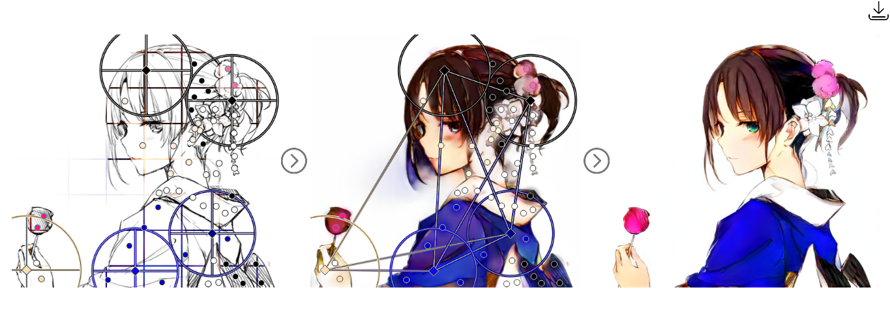
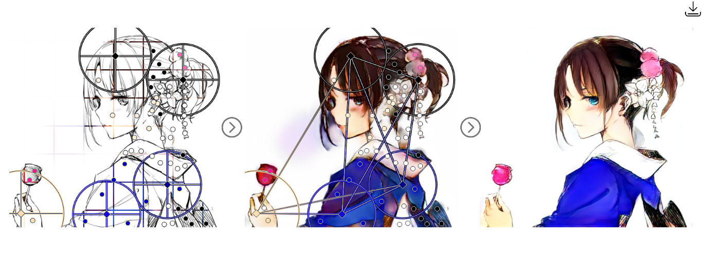
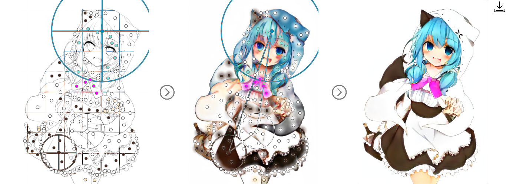
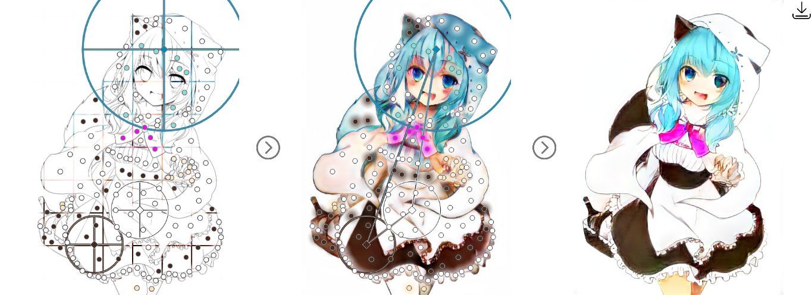

# Style2Paints_V3_Turbo

Develop stage: Beta (More test is needed)

Style2Paints's official repository: [Link](https://github.com/lllyasviel/style2paints). (Thank the authors for providing such an awesome colorization project.)

This **unofficial** repo mainly aims at **accelerating** Style2Paints V3, for those who **DO NOT own NVIDIA graphic card**, including **Intel HD Graphics/AMD GPU** users. Because these graphic cards doesn't support CUDA, currently Style2Paints V4.5 can't use GPU to accelerate the colorization process. Therefore, CPU is used for colorizing, which is much slower than GPU acceleration.

After applying this patch, users (especially with an old/low-end CPU) will get a significant performance boost. On my machine, it makes Style2Paints V3 **2X faster**. In other words, colorization time is shortened to **50%** of the original.

**It is intended for machine learning researchers/programmers, rather than artists**. It pays more attention on performance than art quality.


Related issue: [[Performance Tuning] Workarounds for Intel HD Graphics/AMD GPU Users](https://github.com/lllyasviel/style2paints/issues/146).


# Usage
1. Download the official [Style2Paints V3 Repo](https://github.com/lllyasviel/style2paints/tree/b0a529e70ec1414b53bf5e990d614b121086cd77/V3). 

2. Style2Paints V3's [offline installation guide](https://github.com/lllyasviel/style2paints/issues/100).

Please use the following requirement file instead to avoid [package version conflict](https://github.com/lllyasviel/style2paints/issues/100#issuecomment-645709881). Version of each package has been set to near the release date of Style2paints V3 (2018.4.28).

`pip install -r requirement_cpu.txt`

requirement_cpu.txt:
```
tensorflow==1.10.0
keras==2.1.6
bottle==0.12.13
gevent==1.2.2
h5py==2.7.1
opencv-python==3.4.0.12
scikit-image==0.13.1
paste==2.0.3
```

3. Use the patch files in the `code/` dir to replace the official files.

4. Visit `http://127.0.0.1:8232/` in your web browser. (Default server port has been changed.)


# Performance Tuning

## V3/V4.5 Performance Comparison (CPU Mode)

I conducted a performance test. My hardware and software environment is as the following. Though a bit old, the relative difference in speed is meaningful.

```
CPU: Intel Core i5 3230M (2 cores, 4 threads)
GPU: Intel HD Graphics 4000 (No stand-alone Graphics Card)
RAM: 8 GB DDR3
(Physical memory is enough for Style2Paints V3/V4.5. No system stuck problem during colorization.)
Hard disk: 5400 rpm. No SSD. 

OS: Win 8.1 x64
Python environment management: VirtualEnv
```

I tested Style2Paints V3/V4.5 with [this sketch](https://github.com/lllyasviel/style2paints/blob/master/temps/show/sketches/5.jpg). The result is as the following:

**(1) Style2Paints V4.5 (CPU mode):**

| Procedure | Time Cost |
| --- | --- |
| Initialization (Start up) | 1 min 40 s |
| Colorization - the first time | 6 min 43 s |
| Colorization - the second time | 5 min 30 s |

("Colorization for the first time" needs "slicing process", so it requires more time.)


**(2) Style2Paints V3 (CPU mode):**

| Procedure | Time Cost |
| --- | --- |
| Initialization (Start up) | 40 s |
| Sketch Preparation | 26 s |
| Colorization | 1 min 5 s |

From the above result, we can draw a conclusion that: **under CPU mode, Style2Paints V3 is about 5X faster than V4.5**. So, for users who use CPU to colorize, if you feel V4.5's colorization process is too slow, I recommend using Style2Paints V3 instead. But waiting for 1 minute each time is still too slow, so can it run faster?


## Acceleration: Reduce the resolution of the input sketch

Since all the input sketches will be auto resized to specific resolution during the colorization process, manually resizing the sketches using image editing software is useless. Therefore a patch is needed.

Style2Paints V3 resizes all the input sketches to 1024px (short edge). Under default setting, this patch reduce the resolution (short edge) of all the input sketches to 512px. (That is 50% of the original resolution.) As shown in the following results, **this simple optimization will shorten colorization time to 50% of the original!** 

**(1) Sketch Preparation:**

| Acceleration Method | Time Cost |
| --- | --- |
| No (Official Version) | 26 s |
| Reduce resolution | 7 s |

**(2) Colorization:**

| Acceleration Method | Time Cost |
| --- | --- |
| No (Official Version) | 1 min 5 s |
| Reduce resolution | 26 s |

(This method is inspired by [lllyasviel's advice](https://github.com/lllyasviel/PaintingLight/issues/2#issuecomment-618914866) on another non-deep-learning project.)

### About Painting Quality

The optimized painting result will be slightly different from the original ones, but they looks **good enough** (**achieve about 75% of the original quality**), among the sketches I have tested. When the resolution is set among a proper range, the quality is good enough (at least acceptable). The following are some painting quality comparison:

**(1) Official Version (1024px):**


**After Optimization (512px):**


**(2) Official Version (1024px):**


**After Optimization (512px):**


**(3) Official Version (1024px):**


**After Optimization (512px):**


For more comparisons, please refer to the [result comparison](https://github.com/gceboh/Style2Paints_V3_Turbo/tree/master/result_comparison) folder.

The side effect is that the paintings becomes a bit blurry than the original ones due to lower resolution, but the resolution is **enough for viewing on laptop's small screen**. In addition, it's **enough for machine learning beginners**.

If you still want to see clearer image, here are two workarounds: (1) Reduce your browser's windows size, because smaller image looks clearer. This is especially useful for a large-sized monitor. (2) After painting on a low-resolution sketch, tweak the resolution setting and then apply the same color hints to a high-resolution sketch. You will get a similar, but high-resolution colorization result.

### How to choose a proper zoom factor?
To tweak the input sketch's resolution, please modify `sketch_zoom_factor` in `config.ini`. It is safe to modify the ini file during the program is running. After that, ALWAYS remember to **REFRESH** the webpage. Otherwise, it may cause some strange bugs.

Note that:

(1) Set `sketch_zoom_factor` to `1.0` means the same resolution as official version. (As if no patch is installed.)

(2) The closer the zoom factor is to `1.0`, the better the quality of the painting. However, higher zoom factor will lead to slower colorization process. So it's important to find a **balance** between speed and quality. The recommended `sketch_zoom_factor` is `0.5`.

(3) **Warning**: When the sketch's resolution factor is too low (e.g., `0.25`， i.e. `256px`), the network will output a bad colorization result! Although Fully Convolutional Network (FCN) can process arbitrary size of image in theory, it can't produce high quality result for very different size of input. The reason is that it's impossible for a limited training procedure to cover all the input size.


# Fix
- Change default server port. ([Issue #126](https://github.com/lllyasviel/style2paints/issues/126))
- Fix out-of-date tutorial link, currently link to [V3's readme.md](https://github.com/lllyasviel/style2paints/tree/master/V3).
- Print loading model info when initializing. Print info when colorizing.
- Save color hints in `.json` file by default

---

Commercial usage without [Style2Paints's original author](https://github.com/lllyasviel)'s authorization is forbidden. This unofficial repo is distributed in the hope that it will be useful, but without any warranty.
