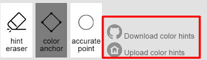

Style2Paints's official repository: [Link](https://github.com/lllyasviel/style2paints). (Thank the authors for providing such an awesome colorization project.)

# Style2Paints_V3_Turbo

Develop stage: Beta (More test is needed)

This **unofficial** repo mainly aims at **accelerating** Style2Paints V3, for those who **DO NOT own NVIDIA graphic card**, including **Integrated Graphics/AMD GPU** users. Because these graphic cards doesn't support CUDA, currently Style2Paints V4.5 can't use GPU to accelerate the colorization process. Therefore, CPU is used for colorizing, which is much slower than GPU acceleration.

After applying this patch, users (especially with an old/low-end/laptop CPU) will get a significant performance boost. On my machine, it makes Style2Paints V3 **2X ~ 6X faster**. In other words, **colorization time is shortened to 16% ~ 50% of the original**.

The following is performance comparisons on an old CPU: (**If you have a more powerful CPU, the time cost will be shorter.**)

| Acceleration Method | Output's Resolution | Time Cost |
| --- | --- | --- |
| No (V3 official version) | 1024px  | 1 min 5 s |
| Reduce input's resolution to 50%  | 512px | 26 s |
| Reduce input's resolution to 50% & Using Draft Cache * | 512px | 15 s |
| Reduce input's resolution to 50% & Using Draft Cache & Disable super-resolution * | 384px | **10 s** |

(* The time cost with star are the second time of colorization. Draft points remain the same with the previous step, and only Accurate points are changed.)

**This acceleration patch is intended for machine learning beginers/programmers, rather than artists**. It pays more attention on performance than art quality.

Related issue: [[Performance Tuning] Workarounds for Integrated Graphics/AMD GPU Users](https://github.com/lllyasviel/style2paints/issues/146).

**Features:**
- Acceleration 1: Reduce image resolution to achieve up to 2X faster.
- Acceleration 2: Use draft cache to accelerate.
- Acceleration 3: Replace deep learning based image super-resolution with mathematical interpolation algorithm.
- Adjustable output resolution, so you can find a balance between speed and quality.
- Support of loading previously saved color hint points.
- Fix some bugs of the official version.

# What's new
[2020.10.24] Patch V2.3.0: Acceleration method improve: Instead of disable deep learning-based image super-resolution, replace it with mathematical interpolation algorithm (Lanczos algorithm).

[2020.10.11] Patch V2.2.1: Fix: Fix a small bug of V3: When extracting line drawings from finished illustrations under the "re-colorization mode", users can't export (save) the extracted line drawings.

[2020.09.23] Patch V2.2.0:

Improve: Allow users to save/load color hints directly on UI.

Improve: Save color hints as downloadable `json` file instead of string, which is more user friendly.

[2020.07.22] Patch V2.1: Acceleration: Temporarily disable image super-resolution.

[2020.07.09] patch v2.0: Acceleration: Use draft cache to accelerate.

[2020.07.03] patch v1.1: New function: Support of loading previously saved color hint points.

[2020.06.30] patch v1.0: Acceleration: Reduce image resolution to achieve 2X faster.

For detailed info, please refer to the [ChangeLog](#changelog).

# Usage

## How to install this patch?
1. Install the official Style2Paints V3.

1.1 Download the official [Style2Paints V3 Repo](https://github.com/lllyasviel/style2paints/tree/b0a529e70ec1414b53bf5e990d614b121086cd77/V3). 

1.2 Style2Paints V3's [installation guide](https://github.com/lllyasviel/style2paints/issues/100).

Please use the following requirement file instead to avoid [package version conflict](https://github.com/lllyasviel/style2paints/issues/100#issuecomment-645709881). Version of each package has been set to near the release date of Style2paints V3 (2018.4.28).

`pip install -r requirement_cpu.txt`

requirement_cpu.txt:
```
tensorflow==1.10.0
keras==2.1.6
bottle==0.12.13
gevent==1.2.2
h5py==2.7.1
opencv-python==3.4.0.12
scikit-image==0.13.1
paste==2.0.3
```

2. Install this unofficial patch:
Use the patch files in the `code/` dir to replace the corresponding official files.

3. After launching the server by `python server.py`, visit `http://127.0.0.1:8232/` in your web browser. (Default server port has been changed.)

<br/>

## Additional Performance Note
Currently I suggest you install TensorFlow through `pip` rather than `conda`. The reason is that, under default setting, TensorFlow installed in `pip` uses all the CPU cores, while TensorFlow installed in `conda` uses only one CPU core, which is much slower. The reason is unknown.

If you still prefer `conda` environment, install `tensorflow-mkl` instead of `tensorflow`. `tensorflow-mkl`'s performance under `conda` is nearly the same as `tensorflow` under `pip`, but it will reduce CPU usage significantly.

```
conda install python==3.6.8
conda install bottle==0.12.13 -c conda-forge
conda install tensorflow-mkl==1.13.1 keras==2.2.4 gevent==1.2.2 h5py==2.7.1 opencv==3.4.1 scikit-image==0.13.1 paste==2.0.3 numpy==1.14.5
```

## How to save/load color hint points?



**Save color hints**: Click the "Download color hints" button, and then a `json` file will be downloaded.

**Load color hints**: Click the "Upload color hints" button, and then choose a previously saved `json` file. Note that even after you tuning the input sketch's resolution by modifying config file, you can still load the previously saved hint points.

**PS: Where is the "Example Gallery" and "Document (Tutorial)"?**

They are on the welcome screen.


# Performance Tuning

## V3/V4.5 Performance Comparison (CPU Mode)

I conducted a performance test. My hardware and software environment is as the following. Though a bit old, the relative difference in speed is meaningful. (**If you have a more powerful CPU, the time cost will be shorter.**)


```
CPU: Intel Core i5 3230M (2 cores, 4 threads)
GPU: Intel HD Graphics 4000 (No stand-alone Graphics Card)
RAM: 8 GB DDR3
(Physical memory is enough for Style2Paints V3/V4.5. No system stuck problem during colorization.)
Hard disk: 5400 rpm. No SSD. 

OS: Win 8.1 x64
Python environment management: VirtualEnv
Browser: Chrome 83
```

I tested Style2Paints V3/V4.5 with [this sketch](https://github.com/lllyasviel/style2paints/blob/master/temps/show/sketches/5.jpg). The result is as the following:

**(1) Style2Paints V4.5 (CPU mode):**

| Procedure | Time Cost |
| --- | --- |
| Initialization (Start up) | 1 min 40 s |
| Colorization - the first time * | 6 min 43 s |
| Colorization - the second time   | 5 min 30 s |

(*: "Colorization for the first time" needs "slicing process", so it requires more time.)


**(2) Style2Paints V3 (CPU mode):**

| Procedure | Time Cost |
| --- | --- |
| Initialization (Start up) | 40 s |
| Sketch Preparation | 26 s |
| Colorization | 1 min 5 s |

From the above result, we can draw a conclusion that: **under CPU mode, Style2Paints V3 is about 5X faster than V4.5**. So, for users who use CPU to colorize, if you feel V4.5's colorization process is too slow, I recommend using Style2Paints V3 instead. But waiting for 1 minute each time is still too slow, so can it run faster?


## Acceleration 1: Reduce the resolution of the input sketch

Since all the input sketches will be auto resized to specific resolution during the colorization process, manually resizing the sketches using image editing software is useless. Therefore a patch is needed.

Style2Paints V3 resizes all the input sketches to 1024px (short edge). Under default setting, this patch reduce the resolution (short edge) of the input sketch and "the 2nd draft" to 512px. (That is 50% of the original resolution.) As shown in the following results, **this simple optimization will shorten colorization time to 50% of the original!** 

**(1) Sketch Preparation:**

| Acceleration Method | Time Cost |
| --- | --- |
| No (Official Version) | 26 s |
| Reduce resolution to 50% | 7 s |

**(2) Colorization:**

| Acceleration Method | Time Cost |
| --- | --- |
| No (Official Version) | 1 min 5 s |
| Reduce resolution to 50% | 26 s |

(This method is inspired by [lllyasviel's advice](https://github.com/lllyasviel/PaintingLight/issues/2#issuecomment-618914866) on another non-deep-learning project.)

### About Painting Quality

The optimized painting result will be slightly different from the original ones, but they looks **good enough** (**achieve about 75% of the original quality**), among the sketches I have tested. When the resolution is set among a proper range, the quality is good enough (at least acceptable). 

The following are some painting quality comparison: (Click the image to view clearer results.)

**(1) Official Version (1024px):**


**After Optimization (512px):**


**(2) Official Version (1024px):**


**After Optimization (512px):**


**(3) Auto Colorization**

**Official Version (1024px):**


**After Optimization (512px):**


For more comparisons, please refer to the [result comparison](https://github.com/gceboh/Style2Paints_V3_Turbo/tree/master/result_comparison) folder.

The side effect is that the paintings becomes a bit blurry than the original ones due to lower resolution, but the resolution is **enough for viewing on laptop's small screen**. In addition, it's **enough for machine learning beginners**.

Tip: For a large-sized monitor, reducing browser's windows size can makes the images look clearer.

### Still want to see high-quality & clearer painting results? 

Here is the workarounds: 

After painting on a low-resolution sketch, tweak the image resolution setting. (Tutorial lies in the next section.) Then **apply the same color hints to a high-resolution sketch** (by using "loading previously saved hint points" function). You will get a similar, but high-resolution colorization result with higher quality.


### How to choose a proper zoom factor?
To tweak the input sketch's resolution, please modify `sketch_zoom_factor` in `/server/config.ini`. It is safe to modify the ini file during the program is running. After that, ALWAYS remember to **REFRESH** the webpage. Otherwise, it may cause some strange bugs.

Note that:

(1) Set `sketch_zoom_factor` to `1.0` means the same resolution as official version. (As if no patch is installed.)

(2) The closer the zoom factor is to `1.0`, the better the quality of the painting. However, higher zoom factor will lead to slower colorization process. So it's important to find a balance between speed and quality. For my CPU, I set `sketch_zoom_factor` to `0.5`. The computing speed of different CPU varies, so you can **adjust resolution to find a balance between speed and quality**.

(3) **Warning**: When the sketch's resolution factor is too low (e.g., `0.25`， i.e. `256px`), the network will output a bad colorization result! Although Fully Convolutional Network (FCN) can process arbitrary size of image in theory, it can't produce high quality result for very different size of input. The reason is that it's impossible for a limited training procedure to cover all the input size.


## Acceleration 2: Using Draft Cache

In interactive painting process, users usually add draft hints at the first time, and then keep them unchanged. On the contrary, users tend to add more (or modify) accurate hints for many times. The reason is that draft hints determine the overall color composition, while accurate hints control the details.

According to the network architecture, a conclusion can be drawn that accurate hint points only affect the refinement model, and have no relationship with the draft model. Beneficial from this design, draft can be cached for acceleration. When draft hints remain the same with the previous step, draft model can be skipped and this patch will load draft directly from cache.

The following is the performance comparison. **This acceleration method can save 10-15 seconds each time (on my machine), without any quality loss.**

| Acceleration Method | Time Cost *|
| --- | --- |
| No (Official Version) | 1 min 5 s |
| **Using Draft Cache** | 50 s |
| Reduce resolution to 50% | 26 s |
| Reduce resolution to 50% & **Using Draft Cache** | **15 s** |

(* The above time cost are the second time of colorization. Draft points remain the same with the previous step, and only accurate points are changed.)

If you want to disable draft cache, please modify `is_draft_cache_enabled` in `config.py`, and restart the python application to apply the setting.

## Acceleration 3: Replace Deep learning-based Image Super-Resolution

Replace Deep learning-based Image Super-Resolution for the painting (the refinement model's output) with mathematical interpolation algorithm. The interpolation algorithm is Lanczos interpolation over 8×8 pixel neighborhood (INTER_LANCZOS4).

It will **save 5~17 seconds** each time on my machine. Though it reduce output's resolution a little, it **won't affect the painting quality**. (Unlike reducing resolution of the refinement model's input)

For acceleration, please follow these steps: (1) Temporarily disable image super-resolution when adjusting color hint points. (2) After all the hints are set properly, turn on super-resolution to render the final output result with higher resolution.

To enable/disable Deep learning-based Image Super-Resolution, please modify `enable_super_resolution` in `config.ini`. It's safe to modify it while the program is running.

Performance comparison:

| Acceleration Method | Output's Resolution | Time Cost |
| --- | --- | --- |
| No (Official Version) | 1024px  | 1 min 5 s |
| **Disable super-resolution** | 512px | 48 s |
| Reduce input's resolution to 50%  | 512px | 26 s |
| Reduce input's resolution to 50% & **Disable super-resolution** | 384px | 21 s |
| Reduce input's resolution to 50% & Using Draft Cache | 512px | 15 s |
| Reduce input's resolution to 50% & Using Draft Cache & **Disable super-resolution** | 384px | **10 s** |


# ChangeLog
Patch V2.3.0:
- Acceleration method improve: Instead of disable deep learning-based image super-resolution, replace it with mathematical interpolation algorithm (Lanczos algorithm).

Patch V2.2.1:
- Fix: Fix a small bug of V3: When extracting line drawings from finished illustrations under the "re-colorization mode", users can't export (save) the extracted line drawings.

Patch V2.2.0:
- Improve: Allow users to save/load color hints directly on UI. (Due to the UI is very hard to modify, two duplicate buttons have been replaced.)
- Improve: Save color hints as downloadable `json` file instead of string, which is more user friendly.
- Fix: Fix a small bug of V3: Can't upload the same sketch for more than once.(This fix was borrowed from S2P V4.5 .)

Patch V2.1:
- Acceleration: Temporarily disable image super-resolution.

Patch V2.0:
- Acceleration: Use draft cache to accelerate.

Patch V1.1:
- New function: Support of uploading previous saved color hint points. ([Issue #47](https://github.com/lllyasviel/style2paints/issues/47), [Issue #116](https://github.com/lllyasviel/style2paints/issues/116))
- fix:"Error 403 Forbidden"(Access Denied) ([Issue #84](https://github.com/lllyasviel/style2paints/issues/84), [Issue #100](https://github.com/lllyasviel/style2paints/issues/100))
- fix: change device to `/cpu:0`. ([Issue #131](https://github.com/lllyasviel/style2paints/issues/131))

Patch V1.0:
- Acceleration: Reduce image resolution to achieve up to 2X faster.
- Enable saving color hints in `.json` file by default. (Actually it is a function for debugging in the official version.)
- fix: Change default server port. ([Issue #126](https://github.com/lllyasviel/style2paints/issues/126))
- fix: Fix out-of-date tutorial link, currently link to [V3's readme.md](https://github.com/lllyasviel/style2paints/tree/master/V3).
- improve: Print loading model info when initializing. Print progress info when colorizing.
- fix: fix TensorFlow Version to 1.X [Issue #133](https://github.com/lllyasviel/style2paints/issues/133), [Issue #100](https://github.com/lllyasviel/style2paints/issues/100)
---

Commercial usage without [Style2Paints's original author](https://github.com/lllyasviel)'s authorization is forbidden. This unofficial repo is distributed in the hope that it will be useful, but without any warranty.
